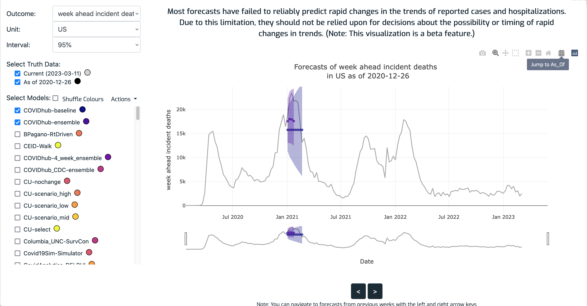

# predtimechart

A JavaScript (ES6 ECMAScript) module for forecast visualization.


# Steps to use the component

To use the component in your app, you'll need to add the following to your HTML:

1. add `<script>` and stylesheet `<link>` tags for dependencies to the `<head>`
2. add a `<div>` to the `<body>` for the component to fill
3. add a `<script>` in the `<body>` that initializes the component via the (default) `App` object that's exported

See the "HTML file example" section below for an example, and see the "JavaScript API" section for how to initialize the component.


# HTML file example

In your HTML file, load the required CSS and JavaScript files:

1. In the `<head>`, load Bootstrap 4 and other required library files:

```html
<!-- Bootstrap 4 -->
<script src="https://cdnjs.cloudflare.com/ajax/libs/popper.js/1.11.0/umd/popper.js"></script>
<script src="https://ajax.googleapis.com/ajax/libs/jquery/1.12.4/jquery.min.js"></script>
<link rel="stylesheet" href="https://cdn.jsdelivr.net/npm/bootstrap@4.1.3/dist/css/bootstrap.min.css">
<script src="https://stackpath.bootstrapcdn.com/bootstrap/4.4.1/js/bootstrap.min.js"></script>

<!-- https://www.daterangepicker.com/ -->
<script type="text/javascript" src="https://cdn.jsdelivr.net/momentjs/latest/moment.min.js"></script>
<script type="text/javascript" src="https://cdn.jsdelivr.net/npm/daterangepicker/daterangepicker.min.js"></script>
<link rel="stylesheet" type="text/css" href="https://cdn.jsdelivr.net/npm/daterangepicker/daterangepicker.css"/>

<!-- predtimechart -->
<script src="https://cdn.plot.ly/plotly-2.12.1.min.js"></script>
<script src="https://cdnjs.cloudflare.com/ajax/libs/moment.js/2.29.3/moment.min.js"></script>
```

2. In the `<body>`, add the row `<div>` that will hold the component:

```html
<div id="forecastViz_row" class="row"></div>
```

3. In the `<body>`, load and use the predtimechart module:

```html
<script type="module">
    // import the module's entry point (the `App` object)
    import App from 'https://cdn.jsdelivr.net/gh/reichlab/predtimechart@1.2.0/predtimechart.js';

    // set up _fetchData, _calcUemForecasts (optional), and options
    function _fetchData(isForecast, targetKey, taskIDs, referenceDate) { ... }

    function _calcUemForecasts(componentModels, targetKey, referenceDate, userModelName) { ... }

    const options = {...};

    // initialize the component: componentDiv, _fetchData, isIndicateRedraw, options, _calcUemForecasts
    App.initialize('forecastViz_row', _fetchData, false, options, _calcUemForecasts);
</script>
```

# JavaScript API

The component is accessed via the `App` object, and is initialized via the `App.initialize()` function. After that, everything else is taken care of by the app.


## About _task ID variables_

Predtimechart has adopted a simplified version of the _modeling tasks_ concept defined in [Modeling Hub task ID variables](https://hubdocs.readthedocs.io/en/latest/format/tasks.html#task-id-vars), and specifically the idea of _task ID variables_. These variables are used in these ways (details follow):

1. Initializing the application's UI: The `task_ids` object passed to App.initialize() via the containing options object (see the "Options object" section below) configures the dropdown menus in the options section of the UI. Specifically, each task ID gets its own dropdown, positioned between the fixed **Outcome** and **Interval** dropdowns. For example, if the options object's `task_ids` specifies two task IDs ("scenario_id" and "location") then there will be two dropdowns between Outcome and Interval: "scenario_id" and "location". Those dropdowns' values will contain the values passed in the `task_ids` object.
1. Initializing the dropdown default values: Predtimechart uses the options object's `initial_task_ids` to select the initial values that the user sees.
1. Args to the `_fetchData` function: When the user takes an action that requires obtaining data, predtimechart will pass the currently-selected values in the above dropdowns to the `_fetchData` function.


## App.initialize() args

`App.initialize(componentDiv, _fetchData, isIndicateRedraw, options, _calcUemForecasts)` takes these args:

- `componentDiv`: `id` of the empty `<div>` to place the component into.
- `_fetchData`: function to retrieve truth and forecast data. It is called whenever the plot needs updating. See the "fetchData data format" section for details. It takes these args:
    - `isForecast`: `boolean` indicating type of data to retrieve. `true` means retrieve forecast data and `false` means get truth data.
    - `targetKey`: `string` naming the target of interest. Must be one of the values in the options object's `target_variables` value.
    - `taskIDs`: `object` specifying which modeling task to retrieve data for (see _task ID variables_ above). Must be consistent with the `options` object's `task_ids` value (see the "Options object" section for details).
    - `referenceDate`: "" reference date "". Must be one of the values in the options object's `available_as_ofs` value.
- `isIndicateRedraw`: `boolean` that controls whether the plot area should be grayed out while waiting for data requests. Useful for applications that have a noticeable delay when fetching data.
- `options`: `object` that contains initialization data. See the "Options object" section for details.
- `calcUemForecasts`: optional human judgement ensemble model function. pass null to disable the feature. It takes these args:
    - `componentModels`: an array of model names, a subset of those in the `options` object (see below).
    - `targetKey`: same as passed to `_fetchData` above.
    - `referenceDate`: ""
    - `userModelName`: The model's displayed name. Must be a valid name, e.g., no spaces, commas, etc.


# Options object

The component is initialized by a JavaScript object with the following keys and values. See the "Example options object" for a detailed example. See `src/schema.json` for the options object's JSON Schema.

- `available_as_ofs`: `object` that maps `target_variables` `value` to an `array` of dates in 'YYYY-MM-DD' format that have truth and/or forecasts available
- `current_date`:  `available_as_ofs` `value` key to use for the initial plot
- `disclaimer`: `string` providing any important information users should know
- `initial_as_of`: `string` specifying the initial date from 'available_as_ofs' (in 'YYYY-MM-DD' format) to use for the initially-selected _as_of_ date
- `initial_checked_models`: `models` value(s) to use for the initial plot
- `initial_interval`: `intervals` value to use for the initial plot
- `initial_target_var`: `target_variables` `value` key to use for the initial plot
- `initial_task_ids`:  an `object` to use for the initial plot. Its format is identical to `_fetchData()`'s `taskIDs` arg above.
- `initial_xaxis_range`: optional `array` of two dates in 'YYYY-MM-DD' format that specify the initial xaxis range to use. To not initialize the range, either don't pass this key or pass `null` for its value
- `intervals`: `array` of one or more integers between 0 and 100 inclusive, representing percentages (purpose: TBD)
- `models`: `array` of model names (`string`s) that provide data
- `target_variables`: `array` of `object`s defining the target variables in the data. Each object contains three keys:
    - 'value': used as the main value that's passed around for the target
    - 'text': human-readable text
    - 'plot_text': plot text (purpose: TBD)
- `task_ids`: `object` defining the _tasks_ in the data as described in `_fetchData`'s `taskIDs` arg above. The object contains a key for each task ID variable, the value of which is a list of `object`s defining possible values. Those objects have these two keys:
    - `value`: used as the main value that's passed around for the task ID
    - `text`: human-readable text


## Example options object

Here's a real-world example from the [COVID-19 Forecast Hub](https://covid19forecasthub.org/) project. Only the first two items in the lists are shown.

```json
{
  "available_as_ofs": {
    "day_ahead_cumulative_deaths": [
      "2020-03-15",
      "2020-03-22",
      "..."
    ],
    "day_ahead_incident_deaths": [
      "2020-03-15",
      "2020-03-22",
      "..."
    ],
    "...": "..."
  },
  "current_date": "2022-10-22",
  "disclaimer": "Most forecasts have failed to reliably predict rapid changes in the trends of reported cases and hospitalizations..."
  "initial_as_of": "2022-10-12",
  "initial_checked_models": [
    "COVIDhub-baseline",
    "COVIDhub-ensemble"
  ],
  "initial_interval": "95%",
  "initial_target_var": "week_ahead_incident_deaths",
  "initial_task_ids": {"unit": "48"},
  "initial_xaxis_range": null,
  "intervals": ["0%", "50%", "95%"],
  "models": [
    "COVIDhub-baseline",
    "COVIDhub-ensemble",
    "..."
  ],
  "target_variables": [
    {
      "value": "day_ahead_cumulative_deaths",
      "text": "day ahead cumulative deaths",
      "plot_text": "day ahead cumulative deaths"
    },
    {
      "value": "day_ahead_incident_deaths",
      "text": "day ahead incident deaths",
      "plot_text": "day ahead incident deaths"
    },
    "..."
  ],
  "task_ids": {
    "unit": [
      {"value": "48", "text": "Texas"},
      {"value": "US", "text": "US"},
      "..."
    ]
  }
}
```

# fetchData data format

As described above, the `fetchData(isForecast, targetKey, unitAbbrev, referenceDate)` function passed to `App.initialize()` is responsible for returning truth and forecast data as directed by the `isForecast` arg. It uses the other three args to retrieve and return the requested data. The data is in the following formats.


## fetchData truth data format

Truth data is represented as an `object` with x/y pairs represented as columns, where x=date and y=truth_value. The dates must correspond to those in the options object's `available_as_ofs`. For example:

```json
{
  "date": ["2020-03-15", "2020-03-22", "..."],
  "y": [0, 15, "..."]
}
```

## fetchData forecasts data format

Forecast data is an `object` with one entry for each model in the options object's `models`, each of which is in turn an `object` with entries for target end date of the forecast and the quantiles required to use to display point predictions and 50% or 95% prediction intervals. For example:

```json
{
  "UChicagoCHATTOPADHYAY-UnIT": {
    "target_end_date": ["2021-09-11", "2021-09-18"],
    "q0.025": [1150165.71, 1176055.78],
    "q0.25": [1151044.42, 1178626.67],
    "q0.5": [1151438.21, 1179605.9],
    "q0.75": [1152121.55, 1180758.16],
    "q0.975": [1152907.55, 1182505.14]
  },
  "USC-SI_kJalpha": {
    "target_end_date": ["2021-09-11", "2021-09-18"],
    "q0.025": [941239.7761, 775112.557],
    "q0.25": [1010616.1863, 896160.705],
    "q0.5": [1149400.162, 1137280.4614],
    "q0.75": [1313447.0159, 1461013.716],
    "q0.975": [1456851.692, 1771312.0932]
  },
  "...": "..."
}
```


# Development

Following is how to do development-related activities. You must first install the required Node.js packages via `npm install --save-dev`.


## Running unit tests

We use [QUnit](https://qunitjs.com/) for our unit tests. To run the tests, execute the `package.json` `test` script: `npm run test`. You should see output at the bottom like this:

```bash
...
# pass 22
# skip 0
# todo 0
# fail 0
```


## Trying the app locally

We've included `src/index.html` as a simple example of the app in action. The file hard-codes truth and forecast data, and has ata for only one `referenceDate`, but can be useful during development. To use it, follow the below packaging step, serve `dist/index.html` from your development environment (trying to open it directly from the filesystem will cause a [CORS](https://developer.mozilla.org/en-US/docs/Web/HTTP/CORS/Errors/CORSRequestNotHttp) error), and then view it in your browser.


## Updating `/src/schema.json`

We use [Ajv](https://ajv.js.org/) to validate `App.initialize()`'s `options` object. More specifically we use a standalone validation function generated from the schema, which is saved to `schema-validator.cjs`. This file must be regenerated whenever the schema file `/src/schema.json` changes. To do so, execute the `package.json` `ajv_compile` script via `npm run ajv_compile`.


## Packaging the component

We use [webpack](https://webpack.js.org/) to package up all dependencies into a single `dist/predtimechart.bundle.js` file for end users. To do so, execute the `package.json` `build` script via `npm run build`, which will update all files in `dist/`.


# Overall usage and features

TBC


## Jump to as_of date

To jump to a specific "as of" date (i.e., reference date), use the calendar icon in the plot's _modebar_, which is located in the top right of the plot. This strip of gray icons is shown by hovering over the chart. (See the below screenshot for an example.) Clicking the icon will pop up a date picker where you can navigate to a date and then click "Apply" to set it as the current "as of" date. Note that the year select box above calendar is constrained to the current target's data date range. Because not every calendar data has a corresponding "as of" date, picking a date that corresponds to the currently-set "as of" date will not update the display.


## Screenshot




# Human judgement ensemble model

Predtimechart includes an optionally-enabled beta feature that supports creating an ensemble forecast file based on the existing models initialized in the app. These input "component models" are used by the human judgement ensemble model code to calculate forecasts based on those models' data. For now the arithmetic mean is used, but future versions will support other calculations. Note that the feature must be enabled by the predtimechart developer to be available. Otherwise, the "Actions" dropdown menu documented below will not be present.


## Usage
All interactions with the feature take place using the "Actions" dropdown menu next to the "Shuffle Colors" button in the left sidebar. (Note that you will not see that dropdown if the feature is disabled.) The actions are:

- **Add User Ensemble** (always enabled): Creates a new model or replaces the existing one using the currently-selected models as components. Visually, the model works like any other model (shows in the model list and the plot, can be checked/unchecked, re-calculated when changing outcome/unit/reference date, etc.)
- **Remove User Ensemble** (enabled if model exists): Removes the model from model list.
- **Download User Ensemble CSV** (enabled ""): Calls the _`calcUemForecasts` function passed to `App.initialize()` (see above) compute and download a cross-unit forecast. The CSV file format is documented [here](https://docs.zoltardata.com/fileformats/#forecast-data-format-csv).
- **User Ensemble Info...** (enabled if model exists): Shows details about the model: The model's name, its component models, and the last error encountered trying to compute the forecasts, if any.
- **Edit User Ensemble Model Name...** (enabled if model does not exist): Shows a dialog box for renaming the user model from the default. Note: You can only edit the model name when there's no current user ensemble model added. To rename you must first do "Remove User Ensemble" if you've previously added one.
- **Help...**: Takes you to this page.


A typical Human judgement ensemble model workflow is:

1. Explore the existing models' forecasts to decide which might make good component models.
1. Select those component models in the models list in the left sidebar under "Select Models".
1. Select the "Add User Ensemble" item in the "Actions" dropdown menu to add the "User Ensemble" model to the app.
1. Explore the new model's forecasts and either move to the next step if you're happy with them, or repeat the above steps to try other component models.
1. Select "Download User Ensemble CSV" in the "Actions" dropdown menu. This will contact the server, which will compute a forecasts for all units in the system, create a CSV file, and send it back to the app. When done, you will see a notification that the file was downloaded and saved.
